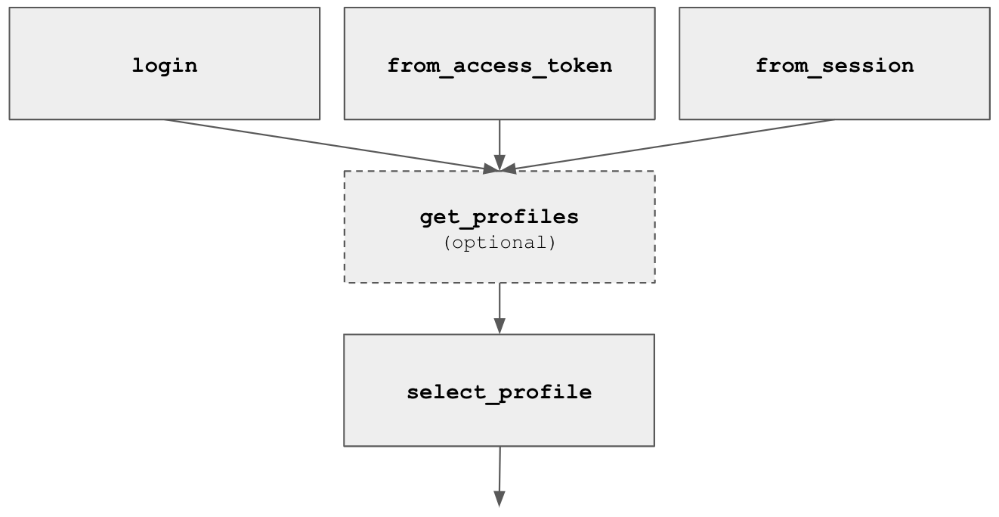

# Tarkov
[](https://crates.io/crates/tarkov)
[](https://docs.rs/tarkov)
[](LICENSE)

An unofficial client library for the [Escape from Tarkov](https://escapefromtarkov.com) (EFT) API.

This library is currently in alpha. Everything may change significantly in future releases.

## Features
- [x] Authentication
- [x] Flea market
- [x] Traders
- [ ] Hideout
- [ ] Inventory management (equip, move, delete, etc)
- [ ] Messenger
- [ ] Quests

## Getting Started

Comprehensive examples can be found in the [`examples`](examples) directory.

### Usage
Add this to your `Cargo.toml`:
```
[dependencies]
tarkov = "0.1"
```

### Authentication

There are three ways to authenticate your EFT account for `tarkov`:
1. Email & password is the easiest way to authenticate your account. However, a captcha and 2FA code may be required. Read the [HWID section](#hardware-id) for more details.
2. Access token or Bearer token can be found by sniffing EFT launcher traffic. HWID from the launcher is required.
3. Session is a cookie called `PHPSESSID`, it can be found by sniffing EFT launcher traffic. HWID is not required for this method.

**Your _PMC_ character profile must be selected with `select_profile` to complete the authentication.**

### Hardware ID
Hardware ID (HWID) may be required on authentication, it can either be sniffed from the EFT launcher or generated. It's recommended to save the HWID in a _persistent store_ and reuse it after the first successful authentication.

Using a fresh HWID means both captcha and 2FA code will be required on your first login attempt. This can be avoid by using the HWID generated by the EFT launcher or authenticating with your session cookie.

### Captcha
This library does not attempt to solve captchas for you, the `g-recaptcha-response` token from reCAPTCHA may be required on authentication.

reCAPTCHA can be solved externally using tools like [captcha-harvester](https://github.com/dzt/captcha-harvester).

### Rust Version
`tarkov` has a minimum version requirement of `1.40`.

## "Unofficial"

I should emphasize that this library is _unofficial_. EFT does not have a public API, everything in this repo was reversed from the game.

The API is clearly designed for internal use. It contains numerous spelling mistakes, inconsistent conventions, and tons of bad practice JSON. The developers may push breaking changes without prior warning.

## License
[MIT](LICENSE)
